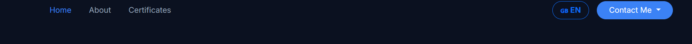
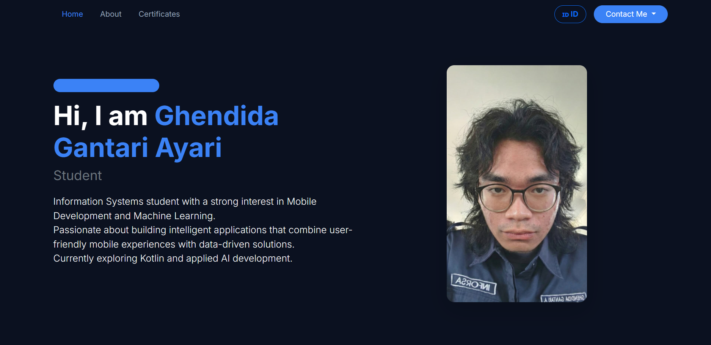
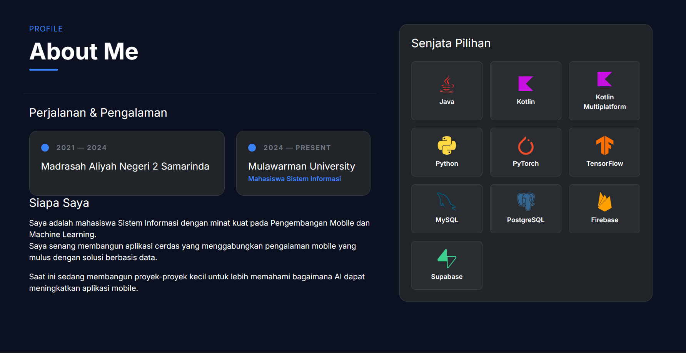
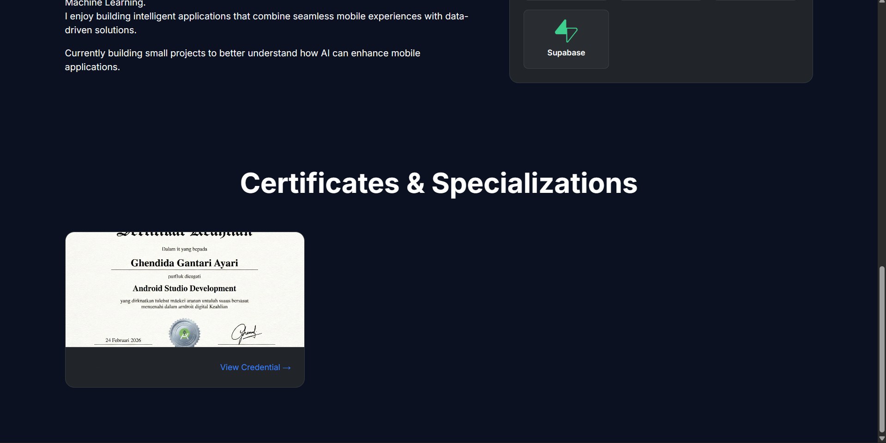

# ✨ Personal Portfolio | Ghendida Gantari Ayari | 2409116080

Projek ini dibuat untuk memenuhi tugas praktikum **Minpro 1 Pemrograman Berbasis Web (PBW)**.

---

## Teknologi yang Digunakan

Website ini dibuat menggunakan kombinasi teknologi berikut agar ringan, responsif, dan mudah dikelola:

* **HTML5 & CSS3** - Sebagai tulang punggung struktur dan riasan visual kustom website.
* **Bootstrap 5.3** - Framework CSS untuk membangun *layout* responsif (Grid system) dan komponen UI yang rapi tanpa perlu pusing memikirkan *media query* dari nol.
* **Vue.js 3 (CDN)** - Digunakan untuk membuat website menjadi dinamis, melakukan *data binding*, dan mengeksekusi fitur *Bilingual* tanpa memuat ulang (*reload*) halaman.
* **Devicon** - *Library* penyedia logo vektor berwarna untuk *tech stack* yang saya gunakan.

---

##  Fitur & Penjelasan Kode

### 1. Dynamic Bilingual Navbar (Fitur Dwibahasa)
**Tampilan:**

**Penjelasan Kode:**
Navbar ini dibuat responsif menggunakan komponen `navbar-collapse` bawaan Bootstrap. di sini ada fitur Dwibahasa (🇬🇧 EN / 🇮🇩 ID) yang bisa mengubah dari bahasa Inggris ke bahasa Indonesia, begitupun sebaliknya. Di dalam instance **Vue.js**, saya menyimpan objek `content` yang berisi kamus bahasa Inggris dan Indonesia.

Saat tombol bahasa diklik, method `toggleLanguage()` dipanggil untuk mengubah nilai variabel `lang`. Karena sifat *reactivity* dari Vue, seluruh teks di HTML yang diikat menggunakan sintaks *mustache* (contoh: `{{ content[lang].role }}`) akan otomatis berganti bahasa saat itu juga secara instan.

### 2. Hero Section (Perkenalan Diri)
**Tampilan:**

**Penjelasan Kode:**
Bagian ini menggunakan sistem Grid Bootstrap (`row` dan `col-lg-6`) agar teks dan foto profil berada bersebelahan di layar pc, namun otomatis menyusun ke bawah saat diakses lewat HP.

Foto profil diberikan manipulasi CSS class `.rounded-4` dan `.shadow-lg` agar terlihat modern dan menonjol dari latar belakang gelap. Teks deskripsi memanggil data langsung dari Vue instance agar terintegrasi dengan sistem dwibahasa, serta ditambahkan `style="white-space: pre-line;"` di HTML agar format *enter/line-break* dari data JavaScript tetap terbaca.

### 3. About Me
**Tampilan:**

**Penjelasan Kode:**
Section ini dibagi menjadi dua kolom. Kolom kiri untuk deskripsi personal, dan kolom kanan untuk menampilkan *tech stack* ("Weapon of Choice").

Daripada menulis elemen HTML satu per satu untuk setiap logo teknologi, saya makai *directive* `v-for="weapon in weapons"` dari Vue. Vue akan melakukan *looping* pada array data keahlian saya (Java, Kotlin, Python, TensorFlow, dll) dan otomatis me-render *grid* logo tersebut. Jika nanti saya belajar atau menguasai teknologi baru, saya cuma perlu menambahkannya ke dalam *array* JavaScript, dan tampilan HTML akan otomatis menyesuaikan. *Clean code!*

### 4. Certificates Gallery
**Tampilan:**

**Penjelasan Kode:**
Koleksi sertifikat ditampilkan menggunakan komponen *Card* dari Bootstrap yang dibungkus dengan Grid `row-cols`. Sama seperti bagian *skills*, *card* ini dirender secara dinamis menggunakan `v-for="cert in certificates"`.

Gambar dipanggil menggunakan *attribute binding* Vue yaitu `:src="cert.image"`. Agar ukuran gambar sertifikat engga gepeng (distorsi) karena dimensi aslinya yang berbeda-beda, saya memakai CSS properti `object-fit: cover;` dengan tinggi *fixed* 200px.

---
